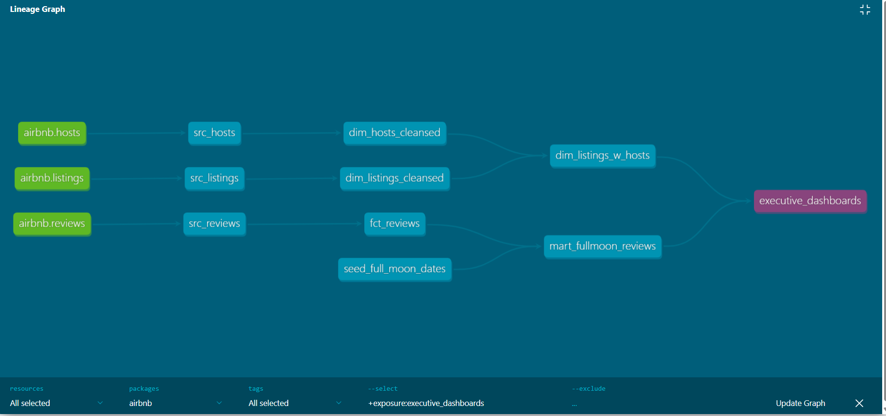

# Airbnb Analytics Platform — dbt + Snowflake + Preset

A complete end-to-end analytics engineering project built using **dbt Core**, **Snowflake**, and **Preset**. This project demonstrates modern data modeling, testing, documentation, lineage tracking, incremenal pipelines and dashboard creation — the workflow real analytics engineering teams use in production.


.png>)


.png>)

---

## Project Overview

This project transforms raw Airbnb data into clean, analytics-ready models using dbt, stores them in Snowflake, and visualizes insights through interactive dashboards in Preset.

The pipeline includes:

- **Source models** — Storing raw Snowfalke tables from S3 bucket
- **Staging models** — Cleaning raw data
- **Intermediate models** — joins, enrichments
- **Dimesnion models** — business entities
- **Fact models** — review events
- **Mart models** — full moon enrichment analytics
- **Tests** — dbt built-in tests + dbt-unit tests + custom generic tests
- **Documentation** — dbt docs + exposures
- **Dashboards** — Preset BI
- **Lineage** — DAG + exposures

---

## Tech Stack

| Layer | Tools |
|---|---|
| Data Warehouse | Snowflake |
| Transformation | dbt Core |
| Testing | dbt built-in tests, dbt-expectations, custom generic tests |
| Documentation | dbt docs, exposures |
| Visualization | Preset (Superset) |
| Version Control | GitHub |

---

## Architecture

.png)

**Flow:** 
Raw Data
   ↓
Snowflake (Landing Layer)
   ↓
dbt Staging Models (Cleaning)
   ↓
dbt Intermediate Models (Joins, Enrichment)
   ↓
dbt Dimension Models (dim_hosts, dim_listings)
   ↓
dbt Fact Models (Incremental fct_reviews)
   ↓
dbt Mart Models (mart_fullmoon_reviews)
   ↓
dbt Tests (Built-in + Custom)
   ↓
dbt Docs (DAG, Lineage, Exposures)
   ↓
Preset Dashboards (Listings, Hosts, Reviews)


---

## Project Structure

```
airbnb/
│
├── models/
│   ├── src/
│   ├── dim/
│   ├── fct/
│   ├── mart/
│   └── dashboards.yml (exposures)
│
├── tests/
│   ├── generic/
│   │   ├── min_row_count.sql
│   │   ├── positive_values.sql
│   │   ├── consistent_created_at.sql
│   │   └── unit_test.yml
│
├── macros/
├── seeds/
├── snapshots/
│
├── dbt_project.yml
└── README.md

```

---
## Models Details

---
## Data Quality Tests

This project includes:

- `unique`
- `not_null`
- `relationships`
- `accepted_values`
- **dbt-expectations** tests (advanced)

Example checks:

- Validate host–listing relationships
- Ensure price is non-negative
- Ensure review dates are valid
- Validate superhost flags

---

## Documentation & Lineage

### Live dbt Documentation
*([dbt docs link here](http://localhost:8080/#!/source_list/airbnb))*

Includes:

- Full DAG
- Model documentation
- Sources
- Tests
- Exposures linking dashboards to dbt models

### DAG Screenshot
**

---

## Dashboards (Preset)
[Presetdashboards- Is_fullmoon or not?](airbnb/models/dashboards.yml)
---

## Key Models

### `dim_listings_w_hosts`
A combined dimension model joining listings and hosts.

Includes:

- `listing_id`
- `host_id`
- `host_name`
- `room_type`
- `neighbourhood`
- `price`
- `host_response_rate`
- `host_is_superhost`
- `host_total_listings`

Used for:

- Listings dashboard
- Host dashboard
- Combined insights
- Exposures

---

## Exposures

This project uses dbt exposures to link BI dashboards to dbt models.

```yaml
exposures:
  - name: executive_dashboards
    type: dashboard
    maturity: low
    url: https://71401034.us1a.app.preset.io/superset/dashboard/p/zWqPYrnYvXM/
    depends_on:
      - ref('dim_listings_w_hosts')
      - ref('mart_fullmoon_reviews')
    owner:
      name: Nithyesh Sakthi
      email: nithyeshsakthi@gmail.com
```

---

## How to Run This Project

**1. Install dependencies**
```bash
pip install dbt-snowflake
```

**2. Configure your Snowflake profile**
Add your credentials to `profiles.yml`.

**3. Run dbt**
```bash
dbt debug
dbt run
dbt test
dbt docs generate
dbt docs serve
```

## What This Project Demonstrates

- Modern analytics engineering workflow
- dbt best practices
- Snowflake warehouse skills
- BI dashboard creation
- Data quality testing
- Incremental Pipelines
- Documentation & lineage
- Real-world business insights

This project is designed to be resume-ready, interview-ready, and certification-ready.
